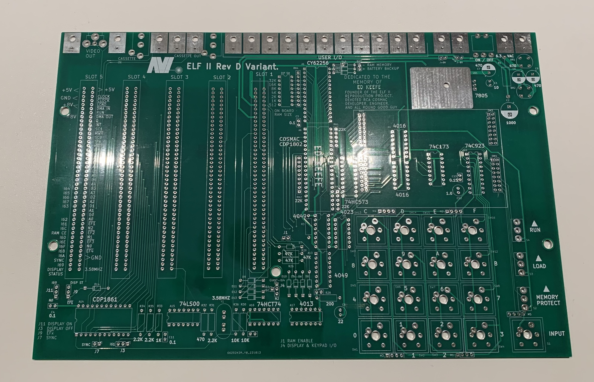

# avi-elf-ii
The AVI ELF II is a reproduction of the 1802-based computer kit by Netronics Research and Development Limited. 

The AVI ELF II computer was reimagined by the late Ed Keefe (1964-2022) to maintain the aesthetic of the original ELF II, with additional onboard RAM and daughter cards for flexibility of keypad encoders and display drivers. 

