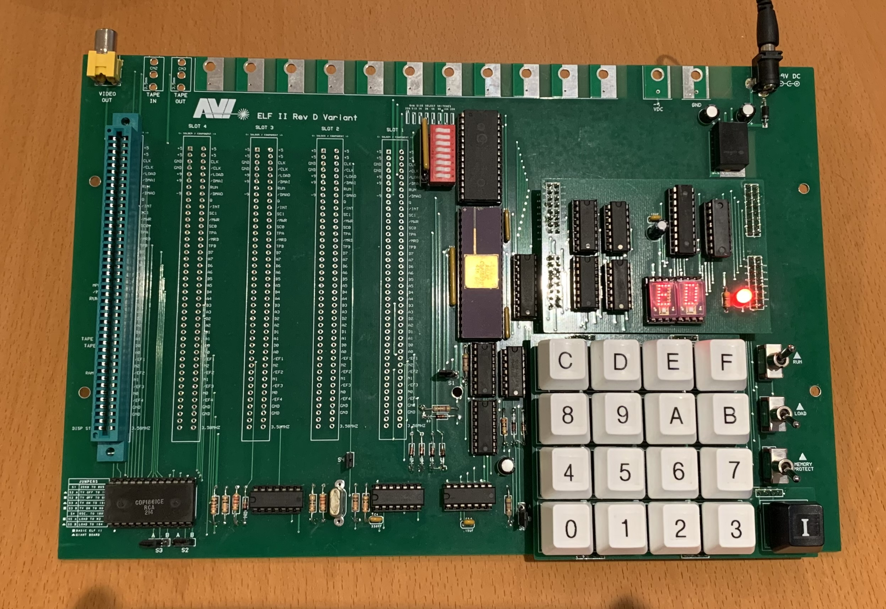

# AVI ELF II
The AVI ELF II is a reproduction of the 1802-based computer kit by Netronics Research and Development Limited. 

The AVI ELF II computer was reimagined by the late Ed Keefe (1964-2022) to maintain the aesthetic of the original ELF II, with additional onboard RAM and daughter cards for flexibility of keypad encoders and display drivers.

This project is ongoing. Below you will find a stable version of the PCB gerber files, bill of materials. The Assembly Manual is in progress and will be uploaded in the very early part of 2024.

There are a number of differences between the AVI ELF II and the original:

* Power on/off toggle switch with power status LED.
* Power is from a single 6 to 9 volt DC supply that supplies the board and expansion cards. Suitable for use with typical 9 volt adapter with barrel connector (center positive). If a V7805-2000R (DC DC CONVERTER 5V 10W) is used in place of the LM7805 voltage regulator, up to 2A of current is available for the board and expansion boards.
* Optional on-board DC-DC coverter for +8 volt / -8 volt supply for original Netronics Giant Board.
* 32Kb on-board RAM with ability to adjust RAM size from 256bytes to 32Kb.
* Optional onboard RAM battery backup.
* Keypad uses modern Cherry MX compatible keyswitches.
* Optional raised Keypad to approximate height of keypad on the original Netronics ELF II.
* Onboard Data Display options for original HP 5082-7740 7-Segment Displays or HP 5082-7340 Dot Matrix LED Display.
* Optional raised display boards for TIL 311 or Dot Matrix Address and Data Displays.
* Optional VIP Personality Board to VIP and ELF (in progress).
* Hyperboard Expansion card for 32KB RAM / 32KB EPROM, CD1852 Byte-Wide Input/Output Ports, CD1854 UART, Cassette IN/OUT with proto area.

### Design Files:

[Schematic](notes/AVIELF2v1-Sch.pdf)

[Bill of Materials](notes/AVI%20ELF%20II%20Final%20BOM.xlsx)

[FAB Files](gerbers/AVIELF2v1-Gerbers.zip)

[KiCAD](kicad/AVIELF2v1-KiCad.zip)

